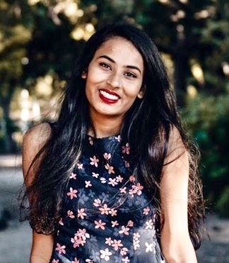

# My Collage
## Hello! My name is Sudiksha.

### About Me
- I am a rising senior at University of California, San Diego with a major in Data Science and minor in Cognitive Science.
- I was born and raised in the Bay Area but my parents are from South India.

### What am I interested in?
- I love dancing! I learned classical Indian dance for many years and also was involved with UCSD’s competitive HFD dance team my freshmen year. I also love watching a lot of hip-hop dance videos in my free time.
- Playing the piano
- I love spending time outdoors and traveling. My family and I like to go on a lot of hikes and we love going on long road trips to visit new places.
- Basketball 🏀  I used to play a lot growing up and now I still like to watch the Warriors play.

### Fun Facts:
- My favorite time of year is Halloween and I love watching horror movies with my friends and going to haunted attractions.
- Favorite TV shows: The 100, Sherlock, Merlin, How I Met Your Mother

I love working with and meeting different people because I think everyone has really unique experiences and there is always something I can learn from that. I am really excited to be able to work at IBM this summer and improve my knowledge and gain hands-on experience of working in the tech industry. 

